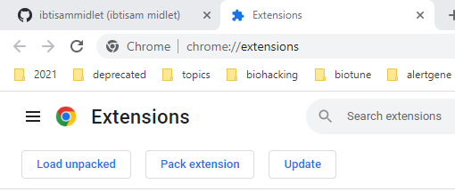
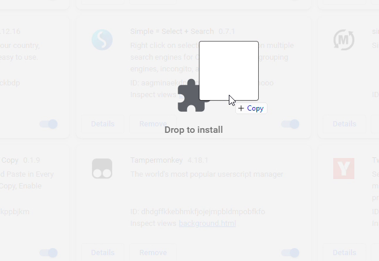

# ##SUBBIND##
facilitating aspergers, perfectionist & synonyms life's
.
.
.
main site : http://www.biotune.org/2021/08/bindingdborg-scraper-targethost-species.html

binding scraper guide >> https://github.com/ibtisammidlet/biotune/blob/main/subbind/addon/lib/bindingdb.js.md
bindingdb.org is a meta search engine that fetch data from other search engine like PSPP,
i tried to find a easy way to know the median binding of a substance using bindingdb.org but the data was hard to use , so i developed a addon that will scrap the data and give you easy way to know the median binding of any substance  

## how to install

